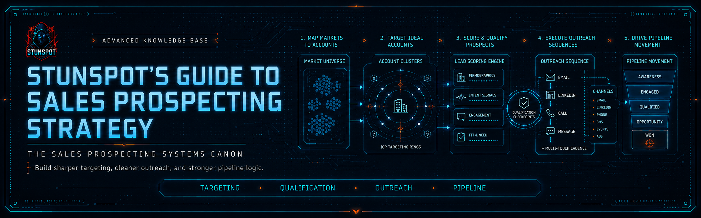

<p align="center">
  
</p>

# Stunspot's Guide to Sales Prospecting Strategy

**A model-facing canon for demand-signal architecture, buyer-system mapping, and AI/RAG prospecting reasoning.**


A machine-readable knowledge canon by Sam “stunspot” Walker / Collaborative Dynamics.

*Stunspot's Guide to Sales Prospecting Strategy* is a Markdown-native Advanced Knowledge Base built primarily for AI/RAG ingestion, project knowledge, long-context workspaces, and model-assisted commercial reasoning.

Its main audience is the model.

Human readers can use it as a field manual, but its deeper purpose is practical augmentation: to give an assisting model the vocabulary, distinctions, causal frames, evidence rules, and diagnostic procedures needed to reason about B2B prospecting as a socio-technical system rather than a volume game.

The canon’s central premise is simple:

> Prospecting is not contact acquisition. It is the evidence-disciplined reading of organizational pressure, commercial legitimacy, buyer-system structure, risk tolerance, and timing.

This repository is therefore less a “sales tips” library than a structured reasoning substrate for demand-signal architecture: how markets create pressure, how organizations translate pressure into priority, how external traces become evidence, how buyer-systems form, how messages earn attention, how outbound operations preserve memory, and how GTM teams diagnose failure without mistaking activity for truth.

Use it as reference material.  
Use it as RAG substrate.  
Use it as project knowledge.  
Use it as doctrine for AI agents, sales strategists, outbound analysts, revenue operators, and GTM builders working on evidence-backed prospecting systems.

---

## Start Here

- [Canon Map](./docs/canon-map.md) — the report sequence and conceptual spine.
- [How to Use This Canon](./docs/how-to-use-this-canon.md) — practical workflows for humans, AI Projects, RAG, and long-context systems.
- [Knowledge Packs](./docs/knowledge-packs.md) — which upload format to use and why.
- [Status](./STATUS.md) — release maturity, contents, and limitations.
- [Manifest](./MANIFEST.md) — complete file inventory and source-to-output mappings.

---

## Corpus Shape

- **16 source reports** in [`knowledge-packs/by-report/`](./knowledge-packs/by-report/)
- **5 compiled packs** in [`knowledge-packs/compiled-packs/`](./knowledge-packs/compiled-packs/)
- **1 omnibus file** in [`knowledge-packs/omnibus/`](./knowledge-packs/omnibus/)
- **1 unclassified source filename** preserved in the manifest metadata

`docs/` contains navigation, GitHub Pages scaffolding, and usage guidance. It is not the source-report corpus. Individual reports live only in `knowledge-packs/by-report/`; compiled upload bundles live in `knowledge-packs/compiled-packs/`; the whole-corpus bundle lives in `knowledge-packs/omnibus/`.

There is no `docs/reports/` directory.

---

## What This Canon Covers

The canon runs from **PROSP-A** through **PROSP-P**, moving from commercial reality to execution diagnostics:

- organizational demand formation, institutional pressure, and budget legitimacy
- macro-financial constraints, capital discipline, and post-zero-rate sales reality
- signal interpretation, evidence hierarchy, commercial epistemology, and confidence calibration
- account reality models, buyer-system mapping, stakeholder cartography, and political navigation
- public signal systems, trigger events, ICP architecture, and market prioritization
- buyer psychology, decision economics, procurement risk, and approval friction
- message engineering, attention economics, narrative framing, and safe next actions
- prospecting systems, channel strategy, sequence architecture, and outbound operations
- commercial data infrastructure, CRM continuity, RAG memory, and AE handoff design
- funnel economics, conversion analytics, failure modes, prospecting pathologies, and intervention strategy

The recurring doctrine is that the commercial state of an account is hidden. A model or practitioner must infer it from evidence, preserve uncertainty, test competing hypotheses, and select actions only when confidence clears the economic threshold of the intended motion.

---

## Who This Is For

This repository is most useful for:

- AI assistants and RAG systems supporting sales strategy, outbound planning, or revenue operations
- GTM strategists designing account prioritization, signal interpretation, and prospecting motions
- SDR/BDR leaders building evidence-backed outbound systems instead of pure activity machines
- RevOps teams working on CRM hygiene, routing logic, intent-data interpretation, and funnel diagnostics
- founders and consultants designing B2B growth systems under capital discipline
- prompt engineers and knowledge-system builders who need a structured commercial reasoning substrate

Human readers should expect dense canon prose, not a lightweight sales blog. The files are intentionally written for retrieval quality, source traceability, terminology stability, and model reasoning.

---

## How To Load It

For most AI systems, start with the **compiled packs**:

| Format | Location | Best Use |
|---|---|---|
| **Source reports** | [`knowledge-packs/by-report/`](./knowledge-packs/by-report/) | Precise retrieval, selective upload, citation, report-level editing, and narrow context loading. |
| **Compiled packs** | [`knowledge-packs/compiled-packs/`](./knowledge-packs/compiled-packs/) | Recommended default for AI Projects, RAG collections, and tools with moderate file-count limits. |
| **Omnibus** | [`knowledge-packs/omnibus/`](./knowledge-packs/omnibus/) | One-file import, local archive, full-corpus search, or systems that handle very large single files well. |

When using the canon with an AI assistant, tell the model to preserve these distinctions:

- an event is not automatically a signal
- a signal is not automatically active demand
- an account is not the same thing as a buyer-system
- budget availability is not the same thing as budget legitimacy
- a meeting is not pipeline unless the evidence chain survives qualification
- high activity can be a symptom of system failure, not proof of prospecting health

That little ontology guardrail prevents a remarkable amount of revenue theater. Tiny mercy. Large effect.

---

## Repository Structure

```text
.
├── README.md
├── LICENSE.md
├── CITATION.cff
├── CHANGELOG.md
├── MANIFEST.md
├── STATUS.md
├── manifest.json
├── COPY_CONTEXT.md
├── docs/
│   ├── index.md
│   ├── canon-map.md
│   ├── how-to-use-this-canon.md
│   ├── knowledge-packs.md
│   ├── _config.yml
│   ├── _layouts/
│   │   └── default.html
│   └── assets/
│       ├── brand/
│       │   └── coldwire-bg.jpg
│       └── css/
│           └── style.css
└── knowledge-packs/
    ├── by-report/
    │   └── 16 individual source reports
    ├── compiled-packs/
    │   └── 5 grouped upload packs
    └── omnibus/
        └── 1 whole-corpus bundle
```

Image references for future hero and social assets are intentionally retained even when the image files have not been created yet.

---

## Release Metadata

Version: **1.0**  
Released: **2026-06-28**  
License: **CC BY-NC-SA 4.0**

GitHub: https://github.com/Stunspot/stunspots-guide-to-sales-prospecting-strategy  
Pages: https://stunspot.github.io/stunspots-guide-to-sales-prospecting-strategy/

---

## Disclaimer

This repository is a knowledge corpus for research, education, design, strategy, and AI/RAG use. It is not legal, financial, or professional sales advice. High-impact claims, strategic decisions, compliance interpretations, and revenue forecasts should be verified against current primary sources and local business context before use.
