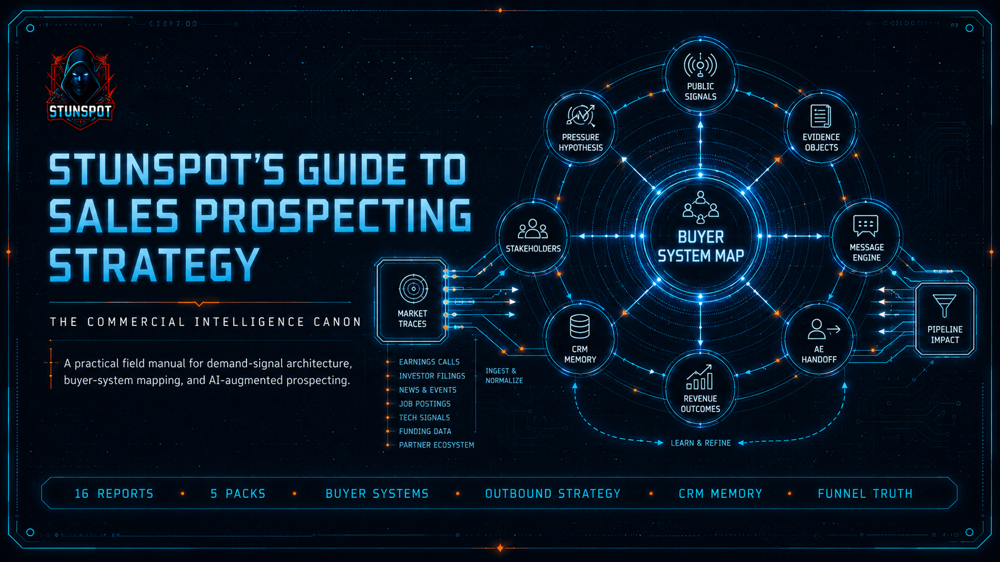

  

# Stunspot's Guide to Sales Prospecting Strategy

**A model-facing canon for demand-signal architecture, buyer-system mapping, and AI/RAG prospecting reasoning.**

This GitHub Pages site is the navigation layer for the repository. The actual source-report corpus does **not** live under `docs/`; it lives in the repository’s `knowledge-packs/` directory.

Use these pages to orient the canon, choose the right upload format, and keep model-facing workflows aligned with the repository’s directory policy.

## Navigation

- [Canon Map](./canon-map.md) — the report sequence from market pressure through failure diagnosis.
- [How to Use This Canon](./how-to-use-this-canon.md) — practical usage patterns for humans, AI Projects, RAG systems, and long-context workspaces.
- [Knowledge Packs](./knowledge-packs.md) — source reports, compiled packs, omnibus format, and upload recommendations.
- [GitHub Repository](https://github.com/Stunspot/stunspots-guide-to-sales-prospecting-strategy) — corpus files, manifest, metadata, and license.

## Corpus at a Glance

| Layer | Path | Contents |
|---|---|---:|
| Source reports | `knowledge-packs/by-report/` | 16 |
| Compiled packs | `knowledge-packs/compiled-packs/` | 5 |
| Omnibus | `knowledge-packs/omnibus/` | 1 |
| Navigation and guides | `docs/` | 4 public guide pages plus site scaffolding |

## Orientation

This canon treats sales prospecting as an evidence discipline. It asks the model to reason from organizational pressure, capital posture, public signals, buyer-system structure, stakeholder incentives, risk paths, message design, CRM memory, funnel economics, and failure diagnosis.

The canon is intentionally dense. It is human-readable, but it is optimized for AI/RAG ingestion: stable terminology, explicit report sequencing, source-to-output mappings, and retrieval-friendly Markdown.

## Recommended First Use

For most AI/RAG systems, upload the **five compiled packs** from `knowledge-packs/compiled-packs/`.

Use individual source reports only when you need narrow retrieval or report-level citation. Use the omnibus only when your tool handles large single-file corpora well.
